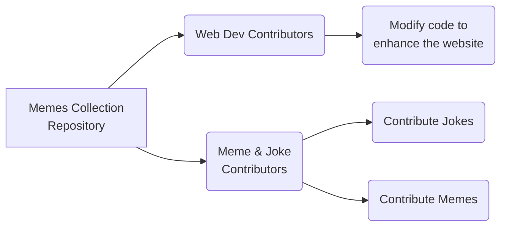

# Coding Memes & Jokes! 🎉

Welcome to the **Coding Memes & Jokes** repository! A place to share your favorite coding memes and jokes.

## Why Contribute?

1. 🎯 **Celebrate Open Source**: Contribute to the open-source community.

2. 🌐**Community Engagement**: Become a part of the global open-source community. You can engage in discussions, share your knowledge, and learn from others.

## Who can contribute to this project?



## How to start contributing?

**Step1**:
**Fork The Repository**

- Use the button at the top right to fork this repository.
  > **Note**: Don't forget to give a star before forking this repository
- You will be directed to "Create a new fork" page, the details will be already filled by default.
- Click on the "Create fork" button on the bottom-right of the page.

  > Now you can freely work on this forked repository of your without affecting the main repository.

**Step2**:
**Clone The Forked Repository**

- Click on the green color dropdown button with "<>Code" written on it.
- Copy the HTTPS link given in it.
- Open Git Bash in any folder on your local device and then give the following command.
-

  ```
  git clone <paste the link here>
  ```

**Step3**:
**Navigate to the repository and create a new Branch**

- Open the folder which you have just cloned.
   > Note: The default name of the folder will be "memes-collection"
- Open this folder in VScode.
- Before you make any modifications in any file you must always clear a new branch for the respecitve branch to do so, open git bash in the current folder i.e "hacktoberfest2023-memes-collection" and then give the following command.
-

  ```
  git branch adding-joke
  or
  git checkout -b adding-joke
  ```

  > **Note**: By using the above command a new branch named "adding-joke" will be created which signifies that this branch is going to be used for adding new joke

## How to start this project?

- Once you are done with the above steps.
- Open new VScode terminal for the folder and give the following commands:
  
  ```
  npm install
  npm start
  ```

- After doing this the website will open up in you default browser and thus you will be able to see working the website.

## Adding new Memes or Jokes

- For Memes:
   Add your meme to the `src/MemesCollection.json` file in the following format:

   ```markdown
   {
   "id": <unique-id>,
   "path": "<path-to-your-meme>"
   }
   ```

   Make sure to replace `<unique-id>` and `<path-to-your-meme>` with the appropriate values.
   Place your meme image in the `src/memes/` folder with the same name as the path value in the `MemesCollection.json` file.

- For Jokes:
     Add your joke to the `src/JokesCollection.json` file in the following format:

   ```markdown
   { "id": <unique-id> , "joke": "<your-joke>", "contributor": "<your-name>" }
   ```

   Make sure to replace `<unique-id>`, `<your-joke>`, and `<your-name>` with the appropriate values.

   For id, simply increment the last id in the array. Double-check to be unique (no one else used the same id).

## How to raise a Pull Request?

- After completing all the changes which you have made its time to commit it and then raise a pull request.
- **Stage Your Changes**: in Git bash (for the respective "memes-collection") start giving the following command.

   ```
   git add -A
   or
   git add myfolder/file1.js
   ```

   > **Note**: git add -A will stage all the files which are changes, which sometimes can be a problem, use it only when you have a good idea about this command else you can use the command git add myfolder/file1.js, here myfolder/file1.js is the path of the folder "file1.js" in which you made the changes

- **Commit Your Changes**:

  ```
  git commit -m "Write a short discription about your commit"
  eg
  git commit -m "Added new Meme/Joke"
  or
  git commit -m "Modified the footer"
  ```

- **Push to Your Fork**:

  ```
  git push origin main <branch-name>
  eg
  git push origin main adding-joke
  ```

  This will push all your changes to your forked repository in your GitHub account

- **Creating a Pull Request**: After doing all this go to your github account -> open the folder repository -> switch to the branch in which you have made the changes -> You will find a message being displayed at the top saying "this branch is n commits ahead of the original repository" -> Create pull Request (PR)
  Give a sort title to your PR and a brief discription to it.

For more detailed contribution guidelines, please read [CONTRIBUTING.md](./CONTRIBUTING.md).

## Code of Conduct

We believe in fostering an inclusive community. All contributors are expected to adhere to our [Code of Conduct](./CODE_OF_CONDUCT.md). In case of any violations, the maintainers reserve the right to take appropriate actions.

---
<div align="center">
Happy coding! 🎃

</div>
